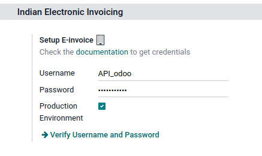
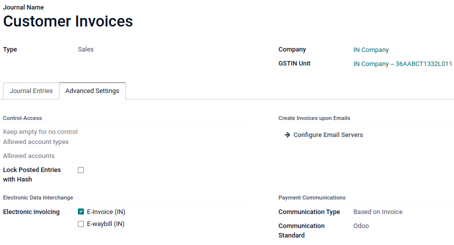

=====
India
=====

.. _india/installation:

Installation
============

:ref:`Install <general/install>` the following modules to get all the features of the Indian
localization:

.. list-table::
   :header-rows: 1

   * - Name
     - Technical name
     - Description
   * - :guilabel:`Indian - Accounting`
     - `l10n_in`
     - Default :doc:`fiscal localization package <../overview/fiscal_localization_packages>`
   * - :guilabel:`Indian E-invoice Integration`
     - `l10n_in_edi`
     - :ref:`Indian e-invoicing integration <india/e-invoicing>`
   * - :guilabel:`Indian GST Return Filing using IAP`
     - `l10n_in_reports_gstr`
     - :ref:`Indian GST Return Filing <india/gstr>`

.. _india/e-invoicing:

Indian e-invoicing
==================

Odoo is compliant with the **Indian Good and Services Tax (GST) e-Invoice system** requirements.

.. important::
   Indian e-invoicing is available from Odoo 15.0. If needed, :doc:`upgrade
   </administration/upgrade>` your database.

.. _india/e-invoicing-api:

Registration on your NIC e-Invoice web portal
---------------------------------------------

You must register on the **NIC e-Invoice** web portal to get your **API credentials**. You need
these credentials to :ref:`configure your Odoo Accounting app <india/e-invoicing-configuration>`.

#. Login to the NIC e-Invoice web portal on - https://einvoice1.gst.gov.in/ by clicking on
   :guilabel:`Login` and entering your :guilabel:`Username` and :guilabel:`Password`.

   .. note::
      If you have already registered on the NIC Eway Bill Production portal, then you can use the
      same login credentials here.

   .. image:: india/e-invoice-system-login.png
      :align: center
      :alt: Register Odoo ERP system on e-invoice web portal

#. From your dashboard, go to :menuselection:`API Registration --> User Credentials --> Create API
   User`.

   .. image:: india/e-invoice-create-api-user.png
      :align: center
      :alt: Click on User Credentials and Create API User

#. After that, you receive an :abbr:`OTP (one-time password)` code to your registered mobile number.
#. Enter the OTP code and click on :guilabel:`Verify OTP`.

   .. image:: india/trigger-otp.png
      :align: center
      :alt: Trigger an OTP to your registerd phone number

#. Select :guilabel:`Through GSP` in the first field, select :guilabel:`Tera Software Limited`
   as your GSP, and type in a :guilabel:`Username` and :guilabel:`Password` for your API.

   .. image:: india/submit-api-registration-details.png
      :align: center
      :alt: Submit API specific Username and Password

#. Click on :guilabel:`Submit`.

.. _india/e-invoicing-configuration:

Configuration on Odoo
---------------------

To set up the e-invoice service, go to :menuselection:`Accounting --> Configuration --> Settings -->
Indian Electronic Invoicing`, and enter the :guilabel:`Username` and :guilabel:`Password`.

.. _india/e-invoicing-journals:

Journals
~~~~~~~~

Your default *sales* journal should be already configured correctly. You can check it or configure
other journals by going to :menuselection:`Accounting --> Configuration --> Journals`. Then, open
your *sales* journal, and in the :guilabel:`Advanced Settings` tab, under :guilabel:`Electronic Data
Interchange`, check :guilabel:`E-Invoice (IN)` and :guilabel:`Save`.

.. _india/e-invoicing-workflow:

Workflow
--------

To start invoicing from Odoo, an invoice must be created using the standard invoicing flow, that is,
either from a sales order or the invoice menu in the Accounting application.

.. _india/invoice-validation:

Invoice validation
~~~~~~~~~~~~~~~~~~

Once the invoice is validated, a confirmation message is displayed at the top.

Odoo automatically uploads the JSON-signed file to the government portal after a while. If you want
to process the invoice immediately, you can click on :guilabel:`Process Now`.

.. image:: india/e-invoice-process.png
   :align: center
   :alt: Indian e-invoicing confirmation message: "The invoice will be processed asynchronously by
         the following E-invoicing service : E-Invoice (IN)"

.. note::
   - You can find the JSON-signed file in the attached files, in the chatter.
   - You can check the status of EDI with web-service under the :guilabel:`EDI Document` tab or the
     :guilabel:`Electronic invoicing` field.

.. _india/invoice-pdf-report:

Invoice PDF Report
~~~~~~~~~~~~~~~~~~

Once the invoice is submitted and validated, you can print the invoice PDF report. The report
includes the :abbr:`IRN (Invoice Reference Number)`, acknowledgment number and date, and QR code.
They certify that the invoice is a valid fiscal document.

.. image:: india/invoice-report.png
   :align: center
   :alt: IRN and QR code

.. _india/edi-cancellation:

EDI Cancellation
~~~~~~~~~~~~~~~~

If you want to cancel an e-invoice, go to the :guilabel:`Other info` tab of the invoice and fill out
the :guilabel:`Cancel reason` and :guilabel:`Cancel remarks` fields. Then, click on
:guilabel:`Request EDI cancellation`. The status of the :guilabel:`Electronic invoicing` field
changes to :guilabel:`To Cancel`.

.. image:: india/e-invoice-cancellation.png
   :align: center
   :alt: cancel reason and remarks

.. note::
   If you want to abort the cancellation before processing the invoice, then click on
   :guilabel:`Call Off EDI Cancellation`.

Once you request to cancel the e-invoice, Odoo automatically submits the JSON Signed file to the
government portal. If you want to process the invoice immediately, you can process it by clicking on
:guilabel:`Process Now`.

.. _india/verify-e-invoice:

Verify the e-invoice from the GST
~~~~~~~~~~~~~~~~~~~~~~~~~~~~~~~~~

After submitting an e-invoice, you can also verify the signed invoice from the GST e-Invoice system
website.

#. Download the JSON file from the attached files.
#. Open the e-invoice portal: https://einvoice1.gst.gov.in/ and go to :menuselection:`Search -->
   Verify Signed Invoice`.
#. Select the JSON file and submit it.

   .. image:: india/verify-invoice.png
      :align: center
      :alt: select the JSON file for verify invoice

#. You can check the verified signed e-invoice here.

   .. image:: india/signed-invoice.png
      :align: center
      :alt: verified e-invoice

.. _india/gstr:

Indian GST Return Filing
========================

Odoo supports **Indian Good and Services Tax (GST) return filing** requirements.

.. _india/gstr_api:

Enable API Access
-----------------

You must enable API Access On the GST Portal.

#. Login to the :guilabel:`GST Portal` on - https://services.gst.gov.in/services/login by entering your
   :guilabel:`Username` and :guilabel:`Password`.

   .. image:: india/gst-portal-login.png
      :align: center
      :alt: Register On GST portal

#. Now, go to :guilabel:`My Profile`.

   .. image:: india/
      :align: center
      :alt: Click On the My Profile from profile

#. Select :guilabel:`Manage API Access`.

   .. image:: india/
      :align: center
      :alt: select Manage API access under the Quick Links.

#. Click :guilabel:`Yes` To Enable API Access.

   .. image:: india/
      :align: center
      :alt: Click Yes

#. Now, You will be able to see duration dropdown menu. Select :guilabel:`duration` of your preference.

   .. image:: india/
      :align: center
      :alt: dropdown list for duration

#. Now, :guilabel:`Confirm` it. You are all set to configure it in odoo :ref:`Configure Your Odoo Indian GST Service <india/gstr_configuration>`.

   .. image:: india/
      :align: center
      :alt: confirm the duration choice

.. _india/gstr_configuration:

Configuration Of Indian GST Service In Odoo
-------------------------------------------

#. To set up the Indian GST service, go to :menuselection:`Accounting --> Configuration --> Settings -->
Indian GST Service`, and enter the :guilabel:`GST Username`. then click on the :guilabel:`send OTP`.

   .. image:: india/gst-setup.png
      :align: center
      :alt: Please enter your GST Portal Username as Username

#. You will receive an OTP on the mobile number linked with the GST Account. Kindly enter the OTP and click
   on the :guilabel:`Validate` Button.

   .. image:: india/gst-otp.png
      :align: center
      :alt: Enter the OTP

.. _india/gstr_workflow:

Workflow Of Filing GST Return
-----------------------------

GST Return Filing using ODOO feature is a 3 step process.
1. Send GSTR-1(Summary of all Sale invoices made during Return period)
2. Receive GSTR-2B(Details submited by vendors)
3. GSTR-3

.. note::
   You can set the Tax Return Periodicity by navigating to the
   :menuselection:`Accounting --> Configuration --> Settings --> Taxes` by changing the :guilabel:`Periodicity`.

After Configuration Of Indian GST Service, You can file your GST Return for the specific duration.
Go to :menuselection:`Accounting --> Reporting --> India --> GST Return Periods` and Create the new GST
Return Period for prefered month and year.

   .. image:: india/gst-return-period.png
      :align: center
      :alt: Create GST Return Period

.. _india/gstr-1

Send GSTR-1
~~~~~~~~~~~

GSTR-1 is a monthly/quarterly return that summarises all sales(outward supplies) of a taxpayer containing 8 section.

#. The First step of Send GSTR-1 you can verify the GSTR-1 Report before pushing it to the :guilabel:`GSTN`
   by clicking on the :guilabel:`Verify the GSTR-1 Report`.
   If GSTR-1 Report is ready to push then you can click on the :guilabel:`Push to GSTN` to push it to the
   :guilabel:`GST Portal`.

   .. image:: india/gst-gstr-1.png
      :align: center
      :alt: GSTR-1

#. Once you click on the :guilabel:`Push to GSTN` then you can see the gstr1_status changes from
   :guilabel:`To Send` to :menuselection:`Sending --> Waiting for Status --> Sent`. It means that
   your GSTR-1 report is submitted on :guilabel:`GST Portal`

   .. image:: india/gst-gstr-1-sent.png
      :align: center
      :alt: GSTR-1 in the Sent Status

#. Once GSTR-1 state reaches in the :guilabel:`Sent` then you can click on the :guilabel:`Mark as Filed`.
   Now , you can see your GSTR-1 status as :guilabel:`Filed`.

   .. image:: india/gst-gstr-1-filed.png
      :align: center
      :alt: GSTR-1 in the Filed Status

.. _india/gstr-2B

Receive GSTR-2B
~~~~~~~~~~~~~~~

#. By clicking on :guilabel:`Fetch GSTR-2B Summary` user can conveniently reconcile ITC(Income Tax Credit)
   with their own Accounts and Records.
   The input tax credit on purchases from any regular taxpayers and non-resident taxable persons will be available in GSTR-2B.
   Further, the input tax credit distributed by the input service distributor.

   .. image:: india/gst-gstr-2b.png
      :align: center
      :alt: GSTR-2B

#. If your all entries of :guilabel:`GSTR-2B` matches with the your Accounts and Records then state will be :guilabel:`Matched` else
   :guilabel:`Partially Matched`.

    .. image:: india/gst-gstr-2b-matched.png
      :align: center
      :alt: GSTR-2B Matched

#. If state in :guilabel:`Partially Matched` then you can check for the conflict by clicking
   :guilabel:`View Reconciled Bills`. You can change the bills that makes the conflict while reconciling
   with the :guilabel:`GSTR-2B`.

   .. note::
      It may be Possible there may be entries in :guilabel:`GSTR-2B` which creates conflict during reconcilation
      then solve that entries first.

   .. image:: india/gst-gstr-2b-partially.png
      :align: center
      :alt: GSTR-2B Partially Matched

#. After refactoring conflicted bills you can click on :guilabel:`re-match` to again reconcile with :guilabel:`GSTR-2B`.

.. _india/gstr-3

GSTR-3
~~~~~~

:guilabel:`GSTR-3` is a monthly return with the summarized details of sales, purchases, sales during the month along with the amount of GST liability.
This return is auto-generated by extracting information from GSTR-1 and GSTR-2.
GSTR-3 displays the GST liability that taxpayer owes. Taxpayer must pay the tax first and then file the return.

#. In odoo you can verify the :guilabel:`GSTR-3` by clicking :guilabel:`GSTR-3 Report`. You need to
   validate the :guilabel:`GSTR-3` on :guilabel:`GST Portal`.

   .. image:: india/gst-gstr-3.png
      :align: center
      :alt: GSTR-1 in the Filed Status
