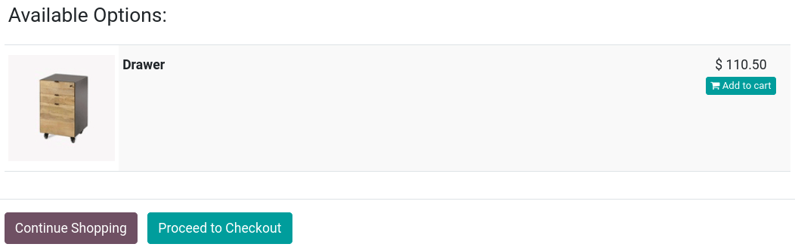
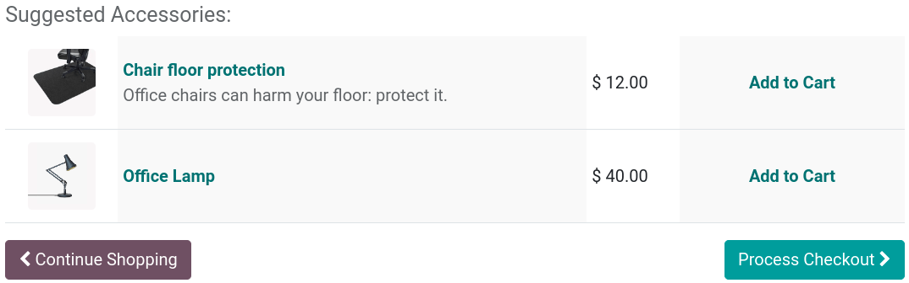
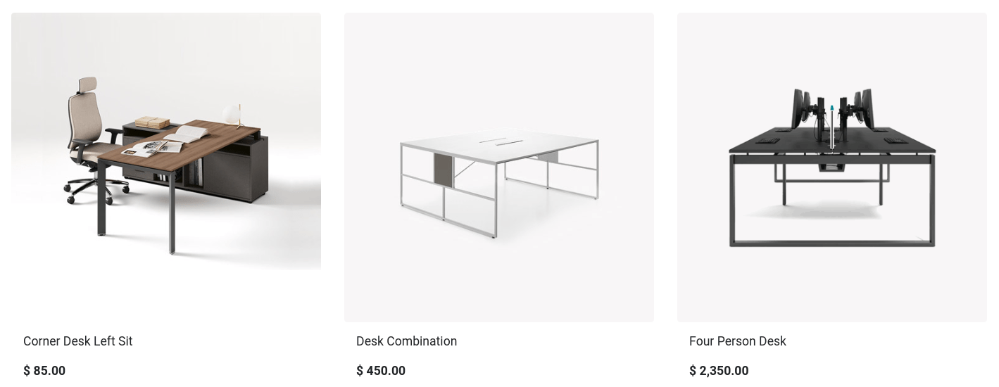

===========================
Cross-selling and upselling
===========================

Any sales process is an opportunity to maximize revenues. **Cross-selling and upselling** are sales
techniques consisting in selling a customer something in addition to the product or service they
were originally shopping for. It is a great way to maximize the value of each one of your customers.

Cross-selling and upselling can be done via three different features:

- :ref:`Optional products <cross_selling/optional>` upon **adding to cart**;
- :ref:`Accessory products <cross_selling/accessory>` on the **checkout page**;
- :ref:`Alternative products <cross_selling/alternative>` on the **product page**.

Cross-selling
=============

.. _cross_selling/optional:

Optional products
-----------------

**Optional products** are suggested when customers click :guilabel:`Add to cart`, either from the
**product page** or **catalog page**. Upon clicking, a pop-up window opens with the
:guilabel:`Optional Products` displayed in the :guilabel:`Available Options` section.

To enable :guilabel:`Optional Products`, go to :menuselection:`Website --> eCommerce --> Products`,
select a product, go to the :guilabel:`Sales` tab, and enter the products you wish to feature in the
:guilabel:`Optional Products`.

.. tip::
   You can also access the :guilabel:`Sales` tab by selecting a product on your **main shop page**,
   and clicking :guilabel:`Product` in the top-right corner.

.. _cross_selling/accessory:

Accessory products
------------------

**Accessory Products** are displayed when customers review their cart before paying, at the
:guilabel:`Review Order` step of the **checkout process** in the :guilabel:`Suggested Accessories`
section.

To enable :guilabel:`Accessory Products`, go to :menuselection:`Website --> eCommerce --> Products`,
select a product, go to the :guilabel:`Sales` tab, and enter the products you wish to feature in the
:guilabel:`Accessory Products`.

Upselling
=========

.. _cross_selling/alternative:

Alternative products
--------------------

**Alternative products** are suggested on the **product page** and usually incentivize customers to
buy a more expensive variant or product than the one they were initially shopping for.

To enable :guilabel:`Alternative Products`, go to :menuselection:`Website --> eCommerce -->
Products`, select a product, go to the :guilabel:`Sales` tab, and enter the products you wish to
feature in the :guilabel:`Alternative Products`. Then, go to the related **product page** by
clicking :guilabel:`Go To Website`, then :menuselection:`Edit --> Blocks`, and drop the
:guilabel:`Products` building block of the :guilabel:`Dynamic Content` section anywhere on the
**product page**.

When placed, in :guilabel:`Edit` mode, click the **block** to access various settings. In the
:guilabel:`Filter` field, select :guilabel:`Alternative Products`. From there, you can configure the
number of elements displayed (:guilabel:`Fetched Elements`), the :guilabel:`Template` used, etc.

